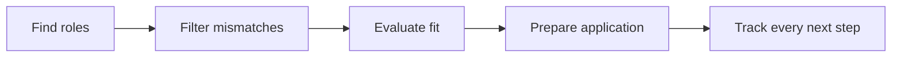

<p align="center">
  <strong>FIND&nbsp;&nbsp;·&nbsp;&nbsp;PREPARE&nbsp;&nbsp;·&nbsp;&nbsp;APPLY&nbsp;&nbsp;·&nbsp;&nbsp;INTERVIEW</strong>
</p>

<p align="center">
  
</p>

<h1 align="center">Frontrunner</h1>

<p align="center">
  <strong>Know which jobs are worth your time.</strong><br>
  Find strong matches, prepare better applications, and keep every next step clear.
</p>

Frontrunner is a local-first job-search product. It finds roles, filters obvious
mismatches before spending model tokens, evaluates the rest against your real
experience, and keeps your applications and documents together on your
computer.

> **Current status:** the workflow-first interface covers setup, discovery,
> assessment, tailored CV preparation, application tracking, and follow-ups.
> Installation still requires Node.js, Git, and an AI coding assistant, so this
> is not yet a one-click consumer install.

## One clear flow



| Local-first | Evidence-grounded | Efficient by design |
|---|---|---|
| Your profile, tracker, reports, and documents stay in your private workspace. | Tailored material can reframe your experience, but never invent it. | APIs and deterministic checks do the mechanical work before a model is used. |

Frontrunner never submits an application. It helps you decide, prepares the
material, and keeps the process organised; you review everything and make the
final call.

## What it does

- **Find** roles across public company and ATS job boards.
- **Filter** clear mismatches such as role family, level, location, or
  compensation before model evaluation.
- **Evaluate** plausible roles against your CV, goals, and constraints.
- **Prepare** a tailored CV, cover letter, outreach, and interview material
  using only supported claims.
- **Track** applications, replies, documents, follow-ups, and outcomes in one
  workflow.

The canonical pipeline is:

```text
scan → cache descriptions → check liveness → prefilter → evaluate
```

Descriptions and liveness use provider APIs where available; Playwright is a fallback.
Only the final evaluation stage needs a model.

## Measured difference

Frontrunner adds bulk job-description ingestion, conservative filtering, and a
compact scoring contract to the inherited workflow.

<!-- pipeline-benchmark:start -->
The checked-in 8-role, 3-board fixture currently produces:

| Measure | inherited flow | Frontrunner | Change |
|---|---:|---:|---:|
| Description HTTP calls | 8 | 3 | −62.5% |
| Approximate model input tokens | 279,030 | 21,441 | −92.3% |
| Approximate model output tokens | 17,125 | 3,123 | −81.8% |
| Roles reaching the model | 8 | 8 | 100% pass rate |
| False rejects at score ≥3.0 | — | 0 | — |

The separate 105-role leadership calibration rejects
15 of 88 roles scoring
below 3.0 (17%) and rejects **0 roles scoring 3.0 or above**.
<!-- pipeline-benchmark:end -->

The fixture is a deterministic regression benchmark, not a promise about every
live job board. Its source is
[`src/benchmark/corpora/pipeline-benchmark.json`](src/benchmark/corpora/pipeline-benchmark.json).
Run `npm run benchmark` to regenerate it, `npm run benchmark:check` to detect a
stale result, or `npm run benchmark:prefilter` to check active filtering rules
against the scored corpus.

## Get started

You need Node.js 22.5 or later, Git, and a tested agent host: Claude Code,
Codex, or Antigravity CLI. Other assistants that consume `AGENTS.md` are
compatibility paths rather than supported configurations.

```bash
git clone https://github.com/Furls-Digital/frontrunner.git
cd frontrunner
npm ci
npm run ui:install
npm run ui
```

Open [http://127.0.0.1:3100/welcome](http://127.0.0.1:3100/welcome) and add your
CV, target roles, and preferences. The interface saves personal and generated
content beneath the ignored `workspace/` directory.

Install Chromium once if you want PDF generation or browser fallback:

```bash
npm run browser:install
```

You can also work conversationally. Open a tested AI coding assistant in the
repository and say:

```text
Set up Frontrunner for me.
Scan for roles that fit my profile.
Evaluate this role for me: https://example.com/job
```

With Codex, use those plain-language prompts in an interactive `codex` session;
slash commands are not guaranteed. For a headless one-shot run, use
`codex exec "Scan for roles that fit my profile."`. See
[`CODEX.md`](CODEX.md) for the complete Codex workflow.

Run the complete backend workflow directly with `npm run pipeline`, or run all
zero-token stages without evaluation using `npm run pipeline:prepare`.

## Data, privacy, and safety

Your CV, profile, tracker, reports, and generated documents are local,
human-readable files beneath `workspace/`. They are gitignored and separated
from updateable application code. Model-backed actions send only the bounded
job text and relevant profile context to the provider you select; Ollama is
available when that content must remain on the machine.

Job adverts and remote responses are treated as hostile input. Network access
is bounded, model inputs are quarantined, evaluators have no local tools, model
output follows closed schemas, and deterministic code owns file writes and
rendering. The UI binds only to loopback and should not be exposed to a LAN or
the public internet.

See the [data contract](DATA_CONTRACT.md) and
[full threat model](docs/frontrunner-threat-model.md) for the precise
boundaries.

## Documentation

| If you want to… | Read |
|---|---|
| Install and complete first-run setup | [Setup guide](docs/SETUP.md) |
| Change roles, filters, providers, or output | [Customization](docs/CUSTOMIZATION.md) |
| Understand how the system fits together | [Architecture](docs/ARCHITECTURE.md) |
| Review local UI operation boundaries | [Application service](docs/APPLICATION_SERVICE.md) |
| Automate recurring scans | [Automation](docs/AUTOMATION.md) |
| Run on free or lower-cost models | [Free tier](docs/FREE_TIER.md) and [budget guide](docs/RUNNING_ON_A_BUDGET.md) |
| Find backend commands | [Scripts reference](docs/SCRIPTS.md) |
| Contribute or review changes | [Contributing](CONTRIBUTING.md) and [reviewing](docs/REVIEWING.md) |

Updates come only from the official Frontrunner repository:

```bash
npm run update:check
npm run update
```

`npm run rollback` restores the most recent pre-update system snapshot.

## Relationship to career-ops

Frontrunner is a fork of [career-ops](https://github.com/santifer/career-ops) by
[Santiago Fernández de Valderrama](https://santifer.io). It retains the
provider ecosystem, scoring framework, file formats, and ethical application
rules while changing collection, filtering, security, orchestration, and the
user experience.

The upstream scanners, providers, evaluation framework, tracker, document
pipeline, and much of the test suite remain foundational. Frontrunner is built
and sponsored by [Furls Digital](https://furls.co.uk) and is independently
named.

MIT licensed. Upstream copyright is retained in [LICENSE](LICENSE), alongside
Furls Digital's copyright for the changes made here.
