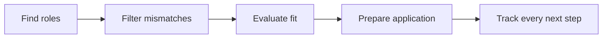

<p align="center">
  <a href="https://frontrunner.website">
    
  </a>
</p>

<h1 align="center">Frontrunner</h1>

<p align="center">
  <strong>Turn your Claude or ChatGPT subscription into a personal job-search assistant.</strong><br>
  Find promising roles, filter the noise, prepare stronger applications, and keep every next step clear.
</p>

<p align="center">
  <a href="https://frontrunner.website">Website</a>
  &nbsp;·&nbsp;
  <a href="#get-started">Install</a>
  &nbsp;·&nbsp;
  <a href="docs/SETUP.md">Setup guide</a>
  &nbsp;·&nbsp;
  <a href="https://github.com/Furls-Digital/frontrunner/issues">Issues</a>
</p>

Frontrunner works through Claude Code or Codex, using the AI subscription you
already have to manage the whole search. It finds roles, clears away obvious
mismatches, evaluates the strongest possibilities against your real experience,
and keeps your applications and documents together on your computer.

> **Current status:** the workflow-first interface covers setup, discovery,
> assessment, tailored CV preparation, application tracking, and follow-ups.
> The local interface includes guided first-run setup; Claude Code, Codex and
> Antigravity remain available for conversational workflows.

## One clear flow



| Local-first | Evidence-grounded | Efficient by design |
|---|---|---|
| Your profile, tracker, reports, and documents are readable files in a workspace on your computer. | Tailored material can reframe your experience, but never invent it. | Repetitive sorting happens first, leaving more of your AI subscription for roles with real potential. |

Frontrunner never submits an application. It helps you decide, prepares the
material, and keeps the process organised; you review everything and make the
final call.

## What it does

- **Find** roles across public company and ATS job boards.
- **Filter** clear mismatches such as role family, level, location, or
  compensation before model evaluation.
- **Evaluate** plausible roles against your CV, goals, and constraints.
- **Prepare** a tailored CV, cover letter, outreach, and interview material
  using only supported claims. A deterministic gate blocks unsupported
  metrics, employers, job titles, and tools before a CV or cover-letter PDF is
  rendered.
- **Track** applications, replies, documents, follow-ups, and outcomes in one
  workflow.

The canonical pipeline is:

```text
scan → cache descriptions → check liveness → prefilter → evaluate
```

Descriptions and liveness use provider APIs where available; Playwright is a fallback.
Only the final evaluation stage needs a model.

## Measured difference

Frontrunner does the repetitive work in groups and filters conservatively before
asking AI to judge a role. The result is less wasted subscription usage without
discarding promising opportunities.

<!-- pipeline-benchmark:start -->
The checked-in 8-role, 3-board fixture currently produces:

| What was measured | inherited flow | Frontrunner | Result |
|---|---:|---:|---:|
| Separate job-listing lookups | 8 | 3 | 62.5% fewer |
| Approximate AI input needed | 288,198 | 21,441 | 92.6% less |
| Approximate AI output needed | 17,125 | 3,123 | 81.8% less |
| Roles kept for AI review | 8 | 8 | All 8 kept |
| Promising roles filtered out | — | 0 | None |

The separate 105-role leadership calibration rejects
15 of 88 roles scoring
below 3.0 (17%) and rejects **0 roles scoring 3.0 or above**.
<!-- pipeline-benchmark:end -->

The fixture is a deterministic regression benchmark, not a promise about every
live job board. Its source is
[`src/benchmark/corpora/pipeline-benchmark.json`](src/benchmark/corpora/pipeline-benchmark.json).
Run `npm run benchmark` to regenerate it, `npm run benchmark:check` to detect a
stale result, or `npm run benchmark:prefilter` to check active filtering rules
against the scored corpus.

## Get started

The easiest route is to open Claude Code or Codex and paste the instruction
below. It is the same on macOS, Linux and Windows: the agent detects the
operating system, checks the prerequisites, explains any permission request,
and completes the supported setup.

Claude Code, Codex and Antigravity CLI are the tested agent hosts. Other
assistants that consume `AGENTS.md` remain compatibility paths rather than
supported configurations.

```text
Set up and install Frontrunner from https://github.com/Furls-Digital/frontrunner in a new folder called frontrunner.

First detect my operating system and check whether Git, Node.js 22.5 or later, and npm are available. If anything is missing or too old, install it using the safest standard method for this operating system. Do not merely tell me to install a prerequisite: perform the setup where you can. Explain any administrator or sudo permission in plain English before requesting it, and never bypass system security controls. Verify git --version, node --version and npm --version before continuing.

Then clone Frontrunner, install its main and local interface dependencies, and follow the repository's onboarding instructions. Do not overwrite an existing folder or change an existing installation without asking. When it is ready, start the local interface and tell me exactly where to open it. If a system dialog or restart is unavoidable, give me one clear step, wait for me to complete it, then continue.
```

Frontrunner then opens locally and walks through the profile it actually needs:
your CV, name, email, location and at least one target job title. It also gives
you the opportunity to confirm salary currency, target and minimum pay, working
pattern, search area, timezone, structured work authorisation, AI usage level,
output language, phone and public links.
Values inferred from an explicitly entered UK location are shown for review;
Frontrunner never fills a missing field with example-person data. The final
screen separates required, recommended and optional gaps, and the profile page
keeps those gaps visible after setup. Personal and generated files are stored
beneath the ignored `workspace/` directory. Model-backed actions send the
relevant bounded context to the provider used by your chosen agent. The local
UI introduces this boundary during onboarding: every allowance-spending action
uses the same violet sparkle button. Its optional first AI action says plainly
that the reviewed CV text will be sent to Claude through the user's connected
Claude subscription and that usage comes from that subscription's allowance.
Claude returns evidence-backed suggestions for the user to select; it cannot
write the profile. Deterministic CV-header/title suggestions remain available
without spending allowance.

Finishing setup is one recoverable backend operation: it publishes the CV and
profile, creates a neutral search brief from confirmed answers, configures the
scanner's title/location filters from those answers, and creates the tracker.
An interrupted save remains visibly incomplete and can be retried without
overwriting an edited search brief or duplicating CV versions. Additional CV
versions remain local reference files and are not silently sent to a model.

<details>
<summary><strong>Prefer to install it manually?</strong></summary>

You need Node.js 22.5 or later and Git:

```bash
git clone https://github.com/Furls-Digital/frontrunner.git
cd frontrunner
npm ci
npm run ui:install
npm run ui
```

Open [http://127.0.0.1:3100/welcome](http://127.0.0.1:3100/welcome). Install
Chromium once with `npm run browser:install` if you want PDF generation or the
browser fallback.

</details>

Once installed, you can also work conversationally. Open a tested AI coding
assistant in the repository and say:

```text
Set up Frontrunner for me.
Scan for roles that fit my profile.
Evaluate this role for me: https://example.com/job
```

With Codex, use those plain-language prompts in an interactive `codex` session;
slash commands are not guaranteed. For a headless one-shot run, use
`codex exec "Scan for roles that fit my profile."`. See
[`CODEX.md`](CODEX.md) for the complete Codex workflow.

Run the complete backend workflow directly with `npm run pipeline`, or run all
zero-token stages without evaluation using `npm run pipeline:prepare`.

## Data, privacy, and safety

Your CV, profile, tracker, reports, and generated documents are local,
human-readable files beneath `workspace/`. They are gitignored and separated
from updateable application code. Model-backed actions send only the bounded
job text and relevant profile context to the provider you select; Ollama is
available when that content must remain on the machine.

Job adverts and remote responses are treated as hostile input. Network access
is bounded, model inputs are quarantined, evaluators have no local tools, model
output follows closed schemas, and deterministic code owns URL parsing,
linear-time prefilter matching, file reads and writes, rendering, and workflow
control. User-supplied filter patterns use an RE2-compatible subset, so a
crafted advertisement cannot trigger catastrophic regex backtracking. The UI
binds only to loopback and should not be exposed to a LAN or the public
internet.

See the [data contract](DATA_CONTRACT.md) and
[full threat model](docs/frontrunner-threat-model.md) for the precise
boundaries.

## Documentation

| If you want to… | Read |
|---|---|
| Install and complete first-run setup | [Setup guide](docs/SETUP.md) |
| Change roles, filters, providers, or output | [Customization](docs/CUSTOMIZATION.md) |
| Understand how the system fits together | [Architecture](docs/ARCHITECTURE.md) |
| Review local UI operation boundaries | [Application service](docs/APPLICATION_SERVICE.md) |
| Automate recurring scans | [Automation](docs/AUTOMATION.md) |
| Run on free or lower-cost models | [Free tier](docs/FREE_TIER.md) and [budget guide](docs/RUNNING_ON_A_BUDGET.md) |
| Find backend commands | [Scripts reference](docs/SCRIPTS.md) |
| Contribute or review changes | [Contributing](CONTRIBUTING.md) and [reviewing](docs/REVIEWING.md) |

Updates come only from the official Frontrunner repository:

```bash
npm run update:check
npm run update
```

`npm run rollback` restores the most recent pre-update system snapshot.

## Relationship to career-ops

Frontrunner is a fork of [career-ops](https://github.com/santifer/career-ops) by
[Santiago Fernández de Valderrama](https://santifer.io). It retains the
provider ecosystem, scoring framework, file formats, and ethical application
rules while changing collection, filtering, security, orchestration, and the
user experience.

The upstream scanners, providers, evaluation framework, tracker, document
pipeline, and much of the test suite remain foundational. Frontrunner is built
and sponsored by [Furls Digital](https://furls.co.uk) and is independently
named.

MIT licensed. Upstream copyright is retained in [LICENSE](LICENSE), alongside
Furls Digital's copyright for the changes made here.
