# Frontrunner threat model

## Executive summary

The inherited design was not safe for hostile job content. It sent remote text
to Claude agents with permission checks disabled, distributed SSRF rules across
individual providers, buffered unbounded responses, and rendered
model-influenced Markdown through a raw HTML sink in a UI that was not
explicitly loopback-only.

Frontrunner now enforces the replacement architecture: one egress broker, a
bounded `JobDocument` quarantine boundary, tool-less schema-constrained model
calls, deterministic writers/renderers, and a loopback-only UI. The detailed
threat tables below preserve the pre-hardening baseline so future upstream
merges cannot quietly reintroduce it.

## Implementation status (2026-07-29)

| Boundary | Status | Enforcement |
|---|---|---|
| Privileged JD-facing agents | Fixed | `src/evaluate/claude-eval.mjs` and `src/cv/claude-tailor.mjs` use safe mode, `--tools ""`, strict MCP isolation, no session persistence and JSON Schema output |
| Central SSRF/redirect policy | Fixed and connection-pinned for shared provider/JD HTTP; browser fallback retains Chromium DNS TOCTOU residual | `src/security/remote-target-policy.mjs`, `providers/_http.mjs`, `src/scan/liveness-browser.mjs` |
| Response/JD/output bounds | Fixed | streaming byte caps in `_http.mjs`; 24K-character JD cap; scoring string/cardinality limits |
| Prompt-injection authority | Fixed | hostile-data framing plus zero-tool models; detection remains telemetry only |
| Report XSS/unsafe links | Fixed in new UI | escaped React rendering, HTTP(S) URL allowlist, CSP, no `dangerouslySetInnerHTML` |
| UI exposure/action boundary | Fixed for intended local deployment | listener pinned to `127.0.0.1`; non-local Host/Origin rejected |
| UI filesystem traversal | Fixed | strict job IDs plus canonical report/output containment |
| Generated HTML active content | Fixed | escaped deterministic builder plus sandbox CSP on previews |
| Provider supply-chain capability audit | Fixed for core adapters; residual reviewed-code trust | regression test forbids direct fetch and child-process imports; `local-parser` remains an explicit operator-configured exception |

The regression suite destructively tests private/metadata targets, private DNS
answers, redirect revalidation, oversized bodies, hostile JD framing,
schema-output flooding, zero-tool Claude arguments, loopback binding and raw
HTML sink removal.

## Scope and assumptions

- In scope: job discovery, provider HTTP access, browser extraction, JD caching,
  deterministic filtering, model-backed evaluation and tailoring, reports,
  tracker writes, and the local Next.js UI.
- Runtime paths are assessed separately from provider/developer code, CI,
  tests, update tooling, and upstream merges.
- The UI is intended for one user and must remain bound to the local machine.
- Core providers use anonymous public endpoints only. Authenticated sources, if
  ever supported, must be isolated as plugins with separate credentials and
  capabilities.
- Every website, API response, feed entry, job URL, job description, and field
  derived from one is attacker-controlled data.
- Candidate CV/profile data, local files, API credentials, and AI CLI sessions
  are sensitive.
- Frontrunner may remove privileged headless-agent execution; compatibility
  with `--dangerously-skip-permissions` is not a requirement.
- Terms-of-service and scraping-policy compliance are important but out of
  scope for this application-security model.

Open questions that would change risk:

- Whether a future packaged desktop application will embed the UI or continue
  to launch a separate localhost server.
- Which model APIs will become the supported tool-less evaluation and tailoring
  backends.
- Whether third-party provider modules will ever be installable independently
  of reviewed Frontrunner releases.

## System model

### Primary components

- Provider registry and adapters discover jobs from anonymous ATS APIs, feeds,
  and public pages (`providers/_registry.mjs`, `providers/*.mjs`).
- Shared HTTP and Playwright code retrieves remote data
  (`providers/_http.mjs`, `src/scan/liveness-browser.mjs`,
  `src/scan/browser-extract.mjs`).
- The canonical pipeline caches descriptions, checks liveness, prefilters, and
  invokes an evaluator (`src/pipeline/run.mjs`,
  `src/scan/fetch-jds.mjs`, `src/scan/prefilter.mjs`).
- API evaluators send candidate context plus JD text to model providers and
  accept versioned JSON (`src/evaluate/*-eval.mjs`,
  `src/evaluate/scoring-contract.mjs`).
- Claude evaluation and UI tailoring launch tool-less, schema-constrained model
  subprocesses; deterministic modules perform the writes
  (`src/evaluate/claude-eval.mjs`, `src/cv/claude-tailor.mjs`).
- Deterministic code writes reports, tracker additions, cached JDs, and PDFs.
- The local Next.js UI reads tracker/report files and renders report Markdown
  (`ui/src/lib/roles.ts`, `ui/src/lib/report.ts`).

### Data flows and trust boundaries

The bullets and threat tables in the remainder of this document describe the
**pre-hardening baseline** unless explicitly marked as a current control. They
are retained as a record of why the inherited implementation was unsafe; use
the implementation-status table above for current behavior.
are retained as regression requirements, not descriptions of current behavior.

- Internet → provider transport: hostile JSON, HTML, XML, redirects, headers,
  and URLs cross HTTP(S). Timeouts and a user agent are centralized, while
  host and redirect policy are mostly provider-owned.
- Internet → Playwright: hostile active web content executes in Chromium.
  Liveness browsing validates public DNS and intercepts subrequests; not every
  browser/fetch path uses the same guard.
- Provider adapter → scanner: loosely typed `Job` objects cross an internal
  plugin boundary. Runtime checks require an array, but there is no complete
  central schema or universal field-size policy.
- Scanner → local cache/pipeline: hostile text and URLs become Markdown, TSV,
  and JD files. Several field escaping and atomic-write controls exist.
- JD cache → deterministic gate: hostile text is interpreted only by code;
  conservative filters record rejection evidence.
- JD cache plus candidate files → model API: hostile JD content and sensitive
  candidate content cross HTTPS to the selected model provider. API evaluators
  expose no tools and validate returned JSON.
- JD cache → Claude CLI worker: hostile content reaches an agent with skipped
  permissions and inherited process/file/network authority.
- Reports/tracker → local UI: model-influenced Markdown and URLs are converted
  to HTML and links. Text is escaped, but link schemes are not centrally
  allowlisted.
- Local browser → Next.js mutation → child process: a local UI action can start
  a privileged Claude process. The scripts do not explicitly pin the listener
  to `127.0.0.1`, and mutation endpoints have no Frontrunner authentication
  layer.
- Reviewed source/upstream merge → provider registry: JavaScript provider files
  are dynamically imported and execute with the scanner's process authority.

#### Diagram

```mermaid
flowchart LR
  A["Hostile job sources"] --> B["Retrieval layer"]
  B --> C["Provider adapters"]
  C --> D["Job cache and pipeline"]
  D --> E["Deterministic gate"]
  E --> F["Tool-less model API"]
  E --> G["Privileged agent worker"]
  F --> H["Validated renderer"]
  G --> I["Local files and tools"]
  H --> J["Reports and tracker"]
  J --> K["Local UI"]
  K --> L["UI server actions"]
  L --> G
```

## Assets and security objectives

| Asset | Why it matters | Security objective (C/I/A) |
|---|---|---|
| CV, profile, portfolio and interview material | Contains identity, employment history and private career information | C/I |
| API keys and AI CLI session credentials | Can incur cost and provide access to external accounts | C/I |
| Repository and user-layer files | Drive evaluations, applications, reports and generated documents | I/A |
| Tracker and pipeline state | Incorrect changes can lose opportunities or misrepresent application status | I/A |
| Local network and host services | A malicious source must not turn Frontrunner into an SSRF proxy | C/I/A |
| Evaluation/report integrity | Users make consequential decisions from these outputs | I |
| Compute, model allowance and network quota | Hostile sources could cause excessive processing or spend | A |
| Provenance and audit records | Needed to explain where content came from and which control acted | I/A |

## Attacker model

### Capabilities

- Publish or modify a job advertisement, ATS entry, public feed item, redirect,
  or linked job page.
- Control job titles, descriptions, company/location fields, URLs, Markdown-like
  text, response sizes, response timing, and redirect destinations.
- Include prompt-injection text specifically targeting Claude, Codex, or other
  model instructions.
- Cause a user to scan or evaluate the posting and, for UI threats, persuade
  the user to click a generated link.
- Host DNS names that resolve or re-resolve to attacker-selected addresses.
- Send requests to a locally listening UI when the host/browser/network permits
  it, including cross-origin attempts from a malicious website.

### Non-capabilities

- The attacker does not initially control Frontrunner source code, local config,
  the user's OS account, or GitHub credentials.
- Anonymous core providers do not receive user authentication tokens.
- A job advertiser cannot directly write local files without exploiting a
  browser, parser, model-agent, UI, or path-validation boundary.
- Model API responses alone cannot run tools in the API evaluator paths.

## Entry points and attack surfaces

| Surface | How reached | Trust boundary | Notes | Evidence (repo path / symbol) |
|---|---|---|---|---|
| Provider HTTP transport | Scan configured/public sources | Internet → process | Timeout exists; redirect default is `follow`; no universal destination or byte limit | `providers/_http.mjs` / `fetchWithTimeout` |
| Provider adapters | Dynamically imported source modules | Reviewed code → scanner | Providers own much of host validation and parsing | `providers/_registry.mjs` / `loadProviders` |
| Trust validator | Every scanned job | Provider data → scanner | Flags URL/domain anomalies but never blocks and may be disabled | `providers/_trust-validator.mjs` / `buildTrustValidator` |
| Liveness browser | Unsupported/inconclusive API liveness | Internet → Chromium | Strong initial, DNS and subresource SSRF controls | `src/scan/liveness-browser.mjs` / `checkUrlLiveness` |
| Browser extractor | Public page extraction | Internet → Chromium | Protocol/private-host guard and content cap; guard logic is not shared completely | `src/scan/browser-extract.mjs` / `main`, `normalizeJd` |
| JD bulk cache | ATS board APIs | Internet → local files | HTML stripped; provider descriptions are not uniformly capped | `src/scan/fetch-jds.mjs` / `runFetchJds` |
| Deterministic gate | Every supported evaluator | JD → model eligibility | Conservative and auditable; not a content-security boundary | `src/evaluate/evaluation-gate.mjs` / `evaluateDeterministicGate` |
| Structured API evaluator | User-selected model endpoint | JD plus PII → external model | No tools; HTTPS guard for remote OpenAI-compatible endpoints; strict response parser | `src/evaluate/scoring-contract.mjs`, `src/evaluate/openai-eval.mjs` |
| Claude batch worker | Batch role survives prefilter | Hostile JD → privileged agent | Runs with `--dangerously-skip-permissions`; MCP removal does not remove shell/filesystem authority | `batch/batch-runner.sh` / `claude_args` |
| UI CV builder | User clicks Build CV | Local browser → privileged agent | Starts Claude with skipped permissions | `ui/src/lib/jobs.ts` / `startCvBuild` |
| Report Markdown renderer | User opens role | Model output → HTML | Escapes text but accepts arbitrary Markdown link schemes into `dangerouslySetInnerHTML` | `ui/src/lib/report.ts` / `renderMarkdown`; `ui/src/app/role/[num]/page.tsx` / `Section` |
| UI file readers | Tracker/report links and job IDs | Local data/request path → filesystem | Joins stored/requested strings without canonical containment checks | `ui/src/lib/roles.ts` / `readReport`; `ui/src/lib/jobs.ts` / `readJob` |
| Local parser | Operator-configured provider | Config → child process | Command/script constraints, timeout and output buffer exist; still privileged developer code | `providers/local-parser.mjs` / `resolveInvocation`, `runLocalParser` |

## Top abuse paths in the inherited implementation

1. An attacker publishes a JD containing instructions to inspect local files and
   transmit their contents. The role reaches batch evaluation, Claude reads the
   JD, follows the injected instructions while permissions are skipped, and
   exposes CV data, credentials, or repository content.
2. A malicious JD poisons a report field with a Markdown `javascript:` link.
   Structured JSON parsing accepts the string, deterministic rendering preserves
   it, the local UI inserts it as raw HTML, and a user click executes script in
   the UI origin.
3. A provider or configured public endpoint redirects to a local-network or
   metadata address. A provider that forgot `redirect: 'error'` inherits the
   shared transport's `follow` default and makes the request from the user's
   machine.
4. A malicious source returns a very large or deliberately expensive JSON/HTML
   body. The shared transport buffers/parses it without a byte cap, exhausting
   memory, delaying scans, or inflating model context and cost.
5. A hostile website sends a request to a UI server reachable beyond loopback.
   Without an application authentication/origin boundary, it triggers a
   model-spending server action that starts a privileged Claude process.
6. Prompt injection does not achieve code execution in an API evaluator but
   manipulates recommendation, risk, company, or evidence fields. Valid JSON
   passes schema checks and misleads the user or poisons tracker/report analysis.
7. A future provider is added quickly to expand source coverage but uses global
   `fetch`, follows redirects, omits host validation, or returns unchecked field
   sizes. Because enforcement is convention-based, one adapter reopens SSRF or
   denial-of-service risks for the entire scanner.
8. A malicious or corrupted tracker/report path escapes its intended directory,
   causing the local UI to read and render an unintended local file if its
   content happens to match the expected format.

## Threat model table

| Threat ID | Threat source | Prerequisites | Threat action | Impact | Impacted assets | Existing controls (evidence) | Gaps | Recommended mitigations | Detection ideas | Likelihood | Impact severity | Priority |
|---|---|---|---|---|---|---|---|---|---|---|---|---|
| TM-001 | Malicious job advertiser | User evaluates or tailors the hostile role through a Claude worker | Prompt-inject a tool-capable agent into reading, changing or exfiltrating local data | Local code/tool execution, data theft, credential misuse | CV/profile, credentials, repository, tracker | Batch disables MCP; model-backed API evaluators are tool-less (`batch/batch-runner.sh`, `src/evaluate/*-eval.mjs`) | Batch and UI use `--dangerously-skip-permissions`; inherited environment and broad working directory | Remove privileged agent workers. Use tool-less model APIs returning scoring/tailoring JSON, then deterministic writers. Until replaced, disable these paths or place them in an OS sandbox with scrubbed environment, explicit read-only inputs, isolated output and no arbitrary network | Log every worker capability, file write and outbound target; fail CI on skipped-permission flags | High: hostile text is expected and evaluation is normal | High: remote content can reach local authority | critical |
| TM-002 | Malicious/compromised public endpoint | A provider uses the shared transport without perfect per-source checks | Redirect, DNS-rebind or directly target local/private services | SSRF, local service interaction, metadata/token exposure | Local network, credentials, availability | Strong Playwright DNS/subrequest guard; provider conventions use host locks and `redirect: 'error'` (`src/scan/liveness-browser.mjs`, `providers/README.md`) | `providers/_http.mjs` defaults to `follow`; policy is repeated per adapter | Create one `safe-fetch` broker that validates every hop and resolved address, defaults to no redirects, enforces public destinations and exposes explicit destination capabilities | Structured blocked-egress logs with provider, original URL, resolved IP and redirect hop | Medium: requires one weak/new adapter or endpoint compromise | High on developer/cloud hosts | high |
| TM-003 | Malicious JD/model output | Model reproduces attacker-selected Markdown and user opens it | Insert unsafe URL schemes into report links rendered as raw HTML | Script execution in local UI origin, action triggering, data exposure | UI integrity, local actions, reports | Text HTML characters are escaped (`ui/src/lib/report.ts`) | Link targets are not scheme-validated; `dangerouslySetInnerHTML` is used | Replace string HTML rendering with React nodes or a vetted sanitizing Markdown renderer; allow only `https:`/`http:` for job/report links; add CSP | Log/reject unsafe schemes and malformed report links | Medium: needs model compliance plus user click | High if UI origin can invoke privileged actions | high |
| TM-004 | Malicious website or LAN peer | UI listens beyond loopback or browser permits localhost request | Invoke mutation/server action and start model-spending privileged work | Spend, process spawning, possible TM-001 chaining | Model allowance, local process, repository | UI is intended to be local; actions validate that a tracker role exists (`ui/src/app/actions.ts`) | Local-only binding is not explicit; no Frontrunner auth/CSRF capability; spawned worker is privileged | Bind dev/start explicitly to `127.0.0.1`; reject non-loopback Host/Origin; use a per-launch random action token; make mutations idempotent; remove privileged worker | Log source address, Host, Origin and action ID; alert on non-loopback requests | Medium, conditional on binding/browser behavior | High while action spawns skipped-permission agent | high |
| TM-005 | Malicious public source | Source is fetched by scanner | Return oversized, deeply nested, slow or highly repetitive content | Memory/CPU exhaustion, stuck scans, token-cost inflation | Availability, compute, model allowance | Request timeout; browser JD caps (`providers/_http.mjs`, `src/scan/browser-extract.mjs`) | Shared HTTP consumes full bodies; provider API JD text is not uniformly capped; object/list cardinality loosely bounded | Stream with hard byte limits before parsing; cap nesting/cardinality and every normalized field; cap one JD centrally; limit roles/pages per source and total run budget | Metrics for bytes, parse time, roles, truncation and per-source error rates | High: trivial for public sources | Medium: local DoS/cost, generally recoverable | high |
| TM-006 | Malicious JD | JD reaches a tool-less evaluator | Semantically manipulate otherwise valid structured output | Misranking, false legitimacy, poisoned analysis and user decisions | Evaluation/report integrity | Versioned JSON contract, numeric/enumeration validation, deterministic rendering (`src/evaluate/scoring-contract.mjs`) | JD is not explicitly framed as hostile data; semantic claims cannot be fully schema-validated; strings/counts have weak bounds | Add a central untrusted-content envelope with provenance/hash and explicit instruction hierarchy; bound arrays/strings; independently derive company/title/URL; never allow model output to choose actions | Record contract violations, suspicious instruction patterns and source hashes; expose provenance in reports | High for attempted injection; variable model compliance | Medium: no direct tools, but decisions are consequential | high |
| TM-007 | New or compromised provider code | A provider is added/updated and passes review incompletely | Bypass central transport, return malformed jobs, or execute arbitrary module code at import | Reintroduced SSRF, local code execution, integrity loss | Repository, local host, scanner | Registry shape checks; provider tests and conventions (`providers/_registry.mjs`, `providers/README.md`) | Dynamic import executes provider code; security properties are convention/test-specific | Require declarative provider capabilities and central transport; prohibit global `fetch` and child processes in core providers via audit; schema-validate all returned jobs; review upstream provider changes as code execution | CI provider audit, dependency/code-owner review, inventory of requested hosts | Low for remote advertiser, medium for supply chain | High | medium |
| TM-008 | Corrupted local/model-influenced data | Tracker/report/job ID contains traversal-like path | Read a file outside the intended report/job directory | Local data disclosure in UI, confusing rendered content | Local files, UI integrity | Expected paths are normally code-generated and user-local | `join` is used without realpath/containment validation in UI readers | Resolve canonical paths and require containment under `reports/`, `data/` or `ui/.jobs`; validate job IDs against a strict pattern | Log rejected paths and malformed tracker links | Low under single-user assumptions | Medium | low |

## Criticality calibration

- **Critical:** hostile remote content can reach general local execution or
  high-value secrets with ordinary user workflow. Examples: JD prompt injection
  into a skipped-permission Claude worker; an unauthenticated remote UI action
  that provides equivalent authority.
- **High:** realistic remote input can expose local-network data, execute script
  in the trusted UI origin, materially corrupt decisions, or reliably exhaust a
  run. Examples: centralized-transport SSRF, unsafe report links chained to UI
  actions, unbounded provider responses.
- **Medium:** requires compromised reviewed code, unusual local conditions, or
  produces contained/recoverable integrity loss. Examples: a malicious provider
  release, repeated contract-valid recommendation manipulation without tools,
  persistent scan degradation.
- **Low:** needs prior local data corruption or provides limited disclosure with
  straightforward recovery. Examples: report-path traversal under the confirmed
  single-user model, noisy malformed-field failures.

## Historical focus paths that drove the hardening work

| Path | Why it matters | Related Threat IDs |
|---|---|---|
| `batch/batch-runner.sh` | Previously launched the highest-risk skipped-permission worker; now delegates to the tool-less evaluator | TM-001 |
| `batch/batch-prompt.md` | Historical agent prompt retained for compatibility; no longer used by the batch runner | TM-001, TM-006 |
| `ui/src/lib/jobs.ts` | Previously launched a skipped-permission worker; now invokes deterministic code around a tool-less model | TM-001, TM-004 |
| `ui/src/app/actions.ts` | Mutation boundary from browser to process launch | TM-004 |
| `ui/src/app/api/jobs/[id]/route.ts` | Local API surface and request-controlled job ID | TM-004, TM-008 |
| `ui/src/lib/report.ts` | Former raw-HTML conversion boundary, removed from the role renderer | TM-003 |
| `ui/src/app/role/[num]/page.tsx` | Current safe React rendering and external-link boundary | TM-003 |
| `ui/src/lib/roles.ts` | Resolves tracker-controlled report paths and URLs | TM-003, TM-008 |
| `providers/_http.mjs` | Natural central egress, timeout and response-budget choke point | TM-002, TM-005 |
| `providers/_registry.mjs` | Dynamically imports and routes provider code | TM-007 |
| `providers/_types.js` | Provider result contract lacks enforceable runtime limits | TM-005, TM-007 |
| `providers/_trust-validator.mjs` | Existing trust signal is advisory and configuration-dependent | TM-002, TM-006 |
| `providers/local-parser.mjs` | Controlled child-process provider boundary | TM-007 |
| `src/scan/liveness-browser.mjs` | Strongest existing egress implementation to reuse centrally | TM-002 |
| `src/scan/browser-extract.mjs` | Parallel browser guard that should share one policy module | TM-002, TM-005 |
| `src/scan/fetch-jds.mjs` | Persists hostile descriptions without one universal content cap/envelope | TM-005, TM-006 |
| `src/scan/scan.mjs` | Normalization, trust enrichment and pipeline serialization choke point | TM-005, TM-007 |
| `src/pipeline/run.mjs` | Best location to require the normalized `JobDocument` boundary | TM-001, TM-006 |
| `src/evaluate/scoring-contract.mjs` | Tool-less structured boundary and semantic prompt-injection target | TM-003, TM-006 |
| `src/evaluate/openrouter-runner.mjs` | Retains separate legacy fetch/browser logic | TM-002, TM-005 |
| `src/plugins/plugin-audit.mjs` | Existing audit pattern can be extended to core provider capabilities | TM-007 |

## Implemented central architecture

1. **Implemented:** add `src/security/remote-target-policy.mjs` and use it from both the shared
   HTTP broker and every Playwright route. It must validate scheme, hostname,
   every resolved address, every redirect hop, ports, timeouts and response
   budgets.
2. **Partially implemented:** make `providers/_http.mjs` the only network capability available to core
   providers. Provider modules declare destination patterns and parsers; they
   cannot call global `fetch`, spawn processes, or launch browsers.
3. **Implemented for every model boundary:** `src/security/job-document.mjs`
   produces bounded normalized text, a content hash, truncation state and
   instruction-like telemetry. Canonical URL/provider metadata stays in the
   pipeline and cache index rather than being accepted from model output.
4. **Implemented:** treat suspicious-instruction detection as telemetry only. Never attempt to
   “sanitize away” prompt injection and then trust the remainder.
5. **Implemented:** replace both Claude CLI workers with tool-less scoring and CV-tailoring
   contracts. Model output proposes bounded content; code chooses filenames,
   writes reports/tracker data, renders HTML/PDF and performs state transitions.
6. **Implemented:** pin the UI to loopback, add Host/Origin checks, use
   safe React rendering, and validate every URL and filesystem path at use.
7. **Implemented for central boundaries; provider static audit remains:** add destructive tests proving every provider inherits egress/size policy,
   hostile JDs cannot cause tools or writes, unsafe report links never render,
   localhost actions reject foreign origins, and model output cannot select
   paths or commands.

This design preserves upstream's source-coverage strength: adding a source
becomes a small declarative adapter and parser, while network, content, model,
rendering and state safety are inherited automatically.

## Notes on use

- Covered discovered runtime entry points for anonymous providers, Playwright,
  pipeline/evaluators, batch, local UI, reports and local parser.
- Represented each external and privileged trust boundary in at least one
  threat.
- Kept runtime risks separate from provider supply chain, upstream merges, CI
  and developer-configured local parsers.
- Incorporated the confirmed local-only, single-user UI and anonymous-provider
  constraints.
- Kept authenticated plugins, hosted/multi-user deployment, scraping legality,
  and OS/browser zero-days outside the current ranking.
- The Node HTTP broker pins its socket to the validated DNS answer. Playwright
  validates every requested URL and DNS answer, but Chromium performs the final
  connection itself; DNS rebinding between those two steps remains a browser
  fallback residual. Keep the UI and scanner local and use ordinary host/network
  isolation when running against unknown domains.
