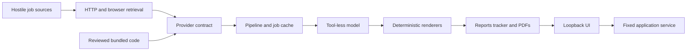

# Frontrunner adversarial security review

## Executive summary

Frontrunner's critical attack paths are materially hardened: hostile
job content crosses a bounded document boundary, model workers have no local
tools, provider HTTP is centrally constrained, the UI renders untrusted report
content without raw HTML, and local writes use contained atomic operations. No
critical or high-severity vulnerability was confirmed under the validated
single-user, loopback-only deployment model. Three low findings were confirmed
and remediated in this review: the UI was pinned to its two canonical loopback
Hosts and Origins, cover-letter links were restricted to HTTPS, and PDF browser
execution/egress was disabled.

A follow-up review on 2026-07-30 found no new critical or high-severity issue
after the first major UI pass. It removed two unnecessary ambient authorities:
the UI no longer infers the repository root from its working directory, and a
browser can no longer supply even a contained generated-document path. The
same review fixed a boundary-contract defect where the interface accepted a
512 KiB CV but the controller rejected requests above 64 KiB; profile saves now
have one explicit 1.5 MiB aggregate cap while every other local protocol keeps
the 64 KiB default.

## Remediation status

| Finding | Severity | Status | Implemented control |
|---|---|---|---|
| FR-002 | Low | Remediated | Footnote links allow only uncredentialed HTTPS URLs |
| FR-003 | Low | Remediated | PDF pages disable JavaScript and abort non-`file:`/`data:` requests |
| FR-004 | Low | Remediated | UI accepts only `127.0.0.1:3100` and `localhost:3100`, with their matching HTTP Origins when present |
| FR-005 | Low | Remediated | Fixed launcher supplies the canonical root and closed Next.js process specification; artifact requests use role IDs rather than paths |
| FR-006 | Reliability | Remediated | Profile transport and Server Action enforce the same explicit 1.5 MiB aggregate cap |

## Scope and assumptions

- In scope: the complete repository, including the current dirty worktree;
  runtime CLI/pipeline paths; provider boundaries; the supported
  `ui/` Next.js application; model evaluation/tailoring; PDF generation;
  application supervision; update/CI configuration; and dependencies.
- The archived `web/` tree was assessed only for its fail-closed runtime
  boundary.
- The UI is used by one person, listens only on the same machine, and will never
  be exposed through a proxy, tunnel, container port, LAN binding, or hosted
  deployment.
- Compromise of the user's local OS account is out of scope.
- Remote job sites, API responses, redirects, descriptions, URLs, and
  model-generated fields are hostile.
- Candidate data, API/CLI credentials, tracker state, reports, and generated
  documents are sensitive.
Open questions: none that materially change the current ranking. Any future
non-loopback UI deployment requires a new review.

## System model

### Primary components

- Core provider adapters and the central HTTP broker retrieve hostile job data
  (`providers/*.mjs`, `providers/_http.mjs`).
- The canonical pipeline caches job descriptions, checks liveness, prefilters,
  and invokes a selected evaluator (`src/pipeline/run.mjs`).
- Tool-less model workers receive framed job text and return bounded structured
  data (`src/security/job-document.mjs`, `src/evaluate/claude-eval.mjs`,
  `src/cv/claude-tailor.mjs`).
- Deterministic code writes reports, tracker state, CVs, cover letters, and PDFs
  (`src/evaluate/scoring-contract.mjs`, `src/cv/`).
- The local Next.js UI reads those artifacts and delegates mutations to a fixed
  application-service operation catalog (`ui/`, `src/application/`).

### Data flows and trust boundaries

- Internet → HTTP broker: hostile URLs, redirects, DNS answers, headers, and
  response bodies cross HTTPS. Destination policy, DNS pinning, timeouts,
  redirect validation, and response-size caps are enforced centrally.
- Provider adapter → provider contract: hostile parsed records cross an
  in-process boundary and are reduced to a closed, bounded job schema.
- Job cache → model: hostile job text plus sensitive candidate context crosses
  a model-provider boundary. Job text is bounded/framed and the model receives
  no local tools.
- Model response → renderer/state: untrusted structured strings cross into
  deterministic renderers and writers. Schemas, string/cardinality limits,
  escaping, URL policy, containment, and atomic replacement constrain them.
- Browser → local UI: one local user's HTTP requests reach the loopback-bound
  Next.js server. Host/Origin validation, CSP, safe React rendering, and fixed
  backend operations protect this boundary.

#### Diagram

## Assets and security objectives

| Asset | Why it matters | Security objective (C/I/A) |
|---|---|---|
| CV, profile, writing samples, interview notes | Personal and employment information | C/I |
| API keys and AI CLI sessions | Account access and model spend | C/I/A |
| Tracker, pipeline, reports, and generated documents | Drive real application decisions | I/A |
| Local files and host services | Must not become reachable through hostile remote content | C/I/A |
| Evaluation and tailoring output | Users rely on it for consequential decisions | I |
| Model allowance and local compute | Hostile inputs must not cause uncontrolled spend or denial of service | A |
| Source, updater, CI, and release artifacts | Define the trusted executable system | I |

## Attacker model

### Capabilities

- Control a job advertisement, public feed/API record, linked URL, redirect, or
  response body that the user scans or evaluates.
- Include prompt-injection text, oversized content, malicious Markdown-like
  strings, deceptive metadata, and attacker-selected URLs.
- Persuade a user to open a generated document or click a generated link.

### Non-capabilities

- The attacker cannot initially control the local OS account, repository source,
  profile/config files, or GitHub credentials.
- The attacker cannot reach the UI over the network under the validated
  deployment model.
- Hostile job text does not receive model tools, shell access, browser access,
  or filesystem access.

## Entry points and attack surfaces

| Surface | How reached | Trust boundary | Notes | Evidence |
|---|---|---|---|---|
| Core provider HTTP | Normal scan/pipeline | Internet → process | DNS-pinned, bounded transport | `providers/_http.mjs:88-194` |
| Provider result contract | Every provider fetch | Parsed remote data → pipeline | Closed/bounded schema | `providers/_contract.mjs:13-235` |
| Playwright liveness/extraction | API-inconclusive postings | Internet → Chromium | SSRF and content controls regression-tested | `src/scan/liveness-browser.mjs`, `src/scan/browser-extract.mjs` |
| Model evaluation/tailoring | Kept cached job | Hostile JD → model | Safe mode, no tools, bounded schemas | `src/evaluate/claude-eval.mjs:41-87`, `src/cv/claude-tailor.mjs:159-186` |
| Local UI | `127.0.0.1:3100` or `localhost:3100` | Browser → application | Listener and request boundary are local-only | `ui/package.json:8-10`, `ui/src/proxy.ts:4-58` |
| Application operations | UI/CLI mutation | Data request → child process | Exact schema and fixed command catalog | `src/application/contract.mjs:14-199`, `src/application/operations.mjs:13-62` |
| Generated document route | Local UI GET | Query path → filesystem | Realpath containment and sandboxed HTML | `ui/src/app/api/file/route.ts:20-64` |
| PDF renderer | CV/cover generation | Generated HTML → Chromium | Local file origin; rendering hardening recommended | `src/cv/generate-pdf.mjs:587-675` |
| Updater and CI | Maintainer/user action | Remote source → trusted code | Fixed updater source; SHA-pinned Actions | `update-system.mjs`, `.github/workflows/` |

## Top abuse paths

1. A generated cover-letter payload supplies a non-HTTP footnote URL; the
   renderer preserves it in an anchor; a user opens/clicks the resulting
   document; the PDF viewer interprets the unsafe scheme.
2. Generated HTML contains active content or remote subresources; the PDF
   renderer loads it from a privileged local-file origin with normal browser
   scripting/network behavior; local content or network metadata could be
   exposed if an upstream escaping invariant regresses.
3. A malicious job ad attempts prompt injection; the bounded data envelope is
   sent to a zero-tool model; even if semantic output is manipulated, schema
   checks and deterministic writers prevent direct code/tool execution.
4. A hostile provider redirects toward a private or metadata endpoint; the
   central broker validates and DNS-pins each hop; the request is rejected.
5. A malicious report contains raw HTML or a `javascript:` Markdown link; the
   React renderer treats it as text or rejects the URL; script execution is
   prevented.

## Threat model table

| Threat ID | Threat source | Prerequisites | Threat action | Impact | Impacted assets | Existing controls | Gaps | Recommended mitigations | Detection ideas | Likelihood | Impact severity | Priority |
|---|---|---|---|---|---|---|---|---|---|---|---|---|
| TM-002 | Malicious or malformed document payload | A footnote URL is supplied and the PDF is opened | Preserve an arbitrary scheme in a clickable PDF link | Viewer-dependent script/action execution or unsafe navigation | User workstation, document integrity | HTML metacharacters are escaped; documented cover flow does not currently emit footnotes | URL scheme is not validated (`src/cv/generate-cover-letter.mjs:92-105`) | Allow only uncredentialed HTTPS footnote URLs; render rejected values as text | Unit-test `javascript:`, `data:`, `file:`, credentialed, and HTTPS cases | Low | Medium | low |
| TM-003 | Future renderer regression or malicious template/payload | Active/remote HTML reaches `renderHtmlToPdf` | Execute page script or fetch remote resources from a `file:` document | Local data/network exposure or nondeterministic output | Candidate data, local files, document integrity | Current CV/cover builders escape content; templates are trusted system files | Chromium page scripting and remote requests are not disabled (`src/cv/generate-pdf.mjs:605-623`) | Disable page JavaScript and abort all non-`file:`/`data:` resource requests during PDF rendering | Test allowed/blocked resource schemes and browser options | Low | High | low |
| TM-004 | Malicious remote website or local web origin | Browser can address local UI | Reach UI actions using a noncanonical loopback Host/Origin | Model spend or state mutation | Model allowance, local state | Server binds `127.0.0.1`; proxy accepts only the canonical `127.0.0.1:3100` and `localhost:3100` identities; Next Server Actions also protect origins | None under the confirmed local-only deployment model | Preserve the exact two-entry allowlist, global matcher, CSP, and fixed backend operations | Regression-test accepted/rejected Host/Origin values | Low | Medium | low |
| TM-005 | Malicious job publisher | User scans/evaluates the role | Prompt-inject model output or attempt local tool execution | Misranking or poisoned prose; no direct host execution | Evaluation integrity | Bounded/fingerprinted hostile-document framing and zero-tool models (`src/security/job-document.mjs`, `src/evaluate/claude-eval.mjs:41-110`) | Semantic manipulation cannot be eliminated completely | Preserve provenance, schema bounds, deterministic metadata, and human review | Record suspicious signals, hashes, truncation, and schema failures | Medium | Medium | medium |
| TM-006 | Malicious public endpoint | Provider retrieves hostile URL/content | SSRF, oversized response, redirect abuse | Local network access or denial of service | Host services, availability | Central DNS-pinned transport, redirect validation, timeouts, byte caps (`providers/_http.mjs:88-194`) | Alternate future fetch paths could bypass the broker | Keep CI prohibition on global fetch in core providers and route new ingestion through the broker | Structured blocked-egress and truncation telemetry | Low | High | low |

## Criticality calibration

- Critical: unauthenticated remote code execution through a normal job scan;
  cross-boundary credential exfiltration without user installation/consent; or
  a remotely reachable UI authentication bypass. None confirmed.
- High: reliable hostile-job-to-host execution, private-network SSRF with a
  normal provider, or widespread sensitive-data disclosure. None confirmed.
- Medium: semantic prompt manipulation of consequential output or repeatable
  model-spend/state abuse with additional preconditions.
- Low: viewer-dependent unsafe links, defense-in-depth renderer gaps, or UI
  hardening issues that require a deployment contrary to the supported
  loopback-only model.

## Focus paths for security review

| Path | Why it matters | Related Threat IDs |
|---|---|---|
| `ui/src/proxy.ts` | Exact loopback Host/Origin and CSP boundary | TM-004 |
| `ui/src/app/actions.ts` | Model-spending local UI mutation | TM-004 |
| `src/application/` | Fixed operation and process-supervision boundary | TM-004 |
| `src/cv/generate-cover-letter.mjs` | Unsafe-link finding | TM-002 |
| `src/cv/generate-pdf.mjs` | Local-file Chromium rendering boundary | TM-003 |
| `providers/_http.mjs` | Central SSRF/response-budget control | TM-006 |
| `providers/_contract.mjs` | Hostile provider-output schema boundary | TM-006 |
| `src/security/job-document.mjs` | Prompt-injection authority boundary | TM-005 |
| `src/evaluate/scoring-contract.mjs` | Model response validation and deterministic rendering | TM-005 |

## Findings by severity

### Low

#### FR-002: Cover-letter footnotes preserved unsafe URL schemes

- Rule: JS URL allowlisting
- Location: `src/cv/generate-cover-letter.mjs:92-105`
- Evidence: `fn.url` is HTML-escaped but not parsed or scheme-checked.
- Impact: a crafted payload can create `javascript:`, `data:`, or `file:` links
  in generated HTML/PDF output.
- Confirmed probe: `buildHtml()` preserved
  `href="javascript:alert(1)"`.
- Remediation: `safeFootnoteUrl()` accepts only uncredentialed HTTPS URLs and
  rejected values render without a link.
- False-positive note: the documented cover flow currently omits `footnotes`,
  and exploitation depends on PDF-viewer behavior and a user click.

#### FR-003: PDF rendering did not disable active content or remote requests

- Rule: isolate untrusted/generated HTML
- Location: `src/cv/generate-pdf.mjs:605-623`
- Evidence: generated HTML is loaded using `page.goto(file://...)` in a normal
  page with JavaScript and network enabled.
- Impact: an escaping/template regression could turn document generation into
  local-file-context script or network execution.
- Remediation: pages are created with JavaScript disabled and routing aborts
  resources whose scheme is not `file:` or `data:`.
- False-positive note: current deterministic CV/cover builders escape payload
  fields and templates are trusted, so no current hostile-content path was
  proven.

#### FR-004: UI request validation was broader than its supported endpoint

- Rule: exact local-origin enforcement
- Location: `ui/src/proxy.ts:4-21`
- Evidence: any `localhost`, `127.0.0.1`, or `::1` Host/Origin and any port are
  accepted, while start scripts bind exactly `127.0.0.1:3100`.
- Impact: broadens the CSRF/rebinding boundary unnecessarily.
- Remediation: requests now require Host `127.0.0.1:3100` or
  `localhost:3100` and, when present, the corresponding canonical HTTP Origin.
  The listener remains bound to `127.0.0.1`; COOP and CORP headers were also
  added.
- False-positive note: under the confirmed single-user loopback-only deployment,
  this is defense in depth rather than a remotely exploitable bug.

## Verification evidence

- Focused UI/application/security regression run: 55/55 passed.
- Live UI probe after canonical restart: the accepted Host returned 200;
  a hostile Host and Origin returned 403; the removed `path` selector and
  malformed role/format selectors returned 400.
- UI TypeScript check and production build passed. The build reports the known
  broad file-tracing warning for server-side user-data reads.
- UI production dependency audit: zero known vulnerabilities.
- UI dependency versions were verified locally (`next` 16.2.12, React 19.2.8,
  Mammoth 1.12.0).
- `node test-all.mjs`: 2,223 passed, 0 failed, 0 warnings, including the
  destructive process, filesystem and browser checks.

## Quality check

- [x] Runtime, UI, provider, model, filesystem, PDF, updater, and CI
  entry points reviewed.
- [x] Every identified trust boundary appears in at least one threat.
- [x] Runtime behavior is separated from CI/dev tooling and archived `web/`.
- [x] User-confirmed localhost-only, single-user, and local-OS-compromise
  assumptions are reflected.
- [x] Existing controls are distinguished from recommendations.
- [x] Findings include evidence, impact, mitigation, and false-positive notes.
